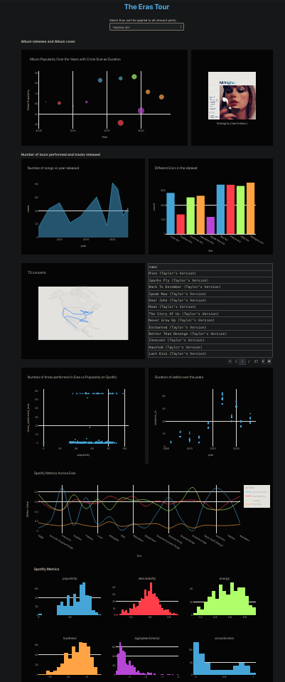

# The Eras Tour: Visualizing the Impact of Taylor Swift's Live Shows

### Motivation:

Taylor Swift’s “Eras Tour” has had an incredibly impactful summer, with the Federal Reserve estimating a nearly $5 billion dollar boost to the economy. We chose to investigate this phenomenon in order to explore the following objectives:

- Global Reach: Visualizing the expansive network of shows across the world and understanding the impact on the community.
- Encoding the magic of live shows: Understanding how Taylor Swift's music captivates live audiences by using Spotify’s audio features (eg: danceability, loudness, tempo) to visualize the changes over the duration of a show.
- Data-driven lessons: Learn how data can inform music, engagement, and performance by correlating track popularity with live occurrences.

### Data Sources

We will construct our own datasets using a combination of two free APIs:
1. Setlist.fm API: Data on setlist and location of a particular artist’s show
This data source will provide us with the necessary information regarding where her shows took place and what songs she played at each show.
2. Spotify API: Data on artist or song such as popularity, genre, audio features
Using the above data, we can map each performed song to their associated metrics on Spotify such as the ones shown on the right.
3. Kaggle: Taylor Concert Tour its impact on attendance and economy, Taylor Swift Era Tour Dataset

### A Glimpse of the Dashboard

### References:

1. [CBS News - Eras Tour Boosting Economy](https://www.cbsnews.com/news/taylor-swift-eras-tour-boosted-economy-tourism-federal-reserve-how-much-money-made/)
2. [Tableau Dashboard - Spotify Top Tracks](https://www.tableau.com/community/music/spotify-top-tracks)
3. [Tableau Dashboard - The Cure Band analysis](https://www.tableau.com/community/music/the-cure)
4. [Tableau Dashboard - Heavy Metal Band analysis](https://www.tableau.com/community/music/heavy-metal)
5. [Setlist API Documentation](https://api.setlist.fm/docs/1.0/ui/index.html)
6. [Spotify API Documentation](https://developer.spotify.com/documentation/web-api)
7. [Kaggle Dataset - Taylor Concert Tour Impact on Attendance](https://www.kaggle.com/datasets/gayu14/taylor-concert-tours-impact-on-attendance-and/data)
8. [What are the Eras](https://www.lsureveille.com/entertainment/what-are-the-eras-on-taylor-swifts-the-eras-tour/article_1ac1587a-cdc6-11ed-8c34-0fdc3d371c29.html)
9. [Eras Tour Money & Economy](https://time.com/6307420/taylor-swift-eras-tour-money-economy/)
